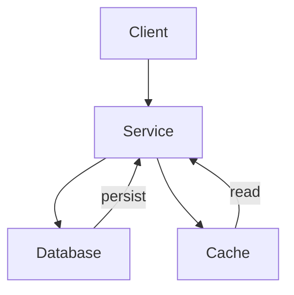

<!--
  WARNING: One-way sync only.
  Edits made directly in Confluence will be overwritten on the next push.
  Confluence is the read surface; the repo is the write surface.
-->

<!-- Space: YOUR_SPACE_KEY -->
<!-- Title: ADR NNNN - Your Decision Title -->
<!-- Parent: Engineering Decisions -->
<!-- Label: adr -->
<!-- Label: architecture -->

# ADR NNNN — Your Decision Title

| | |
|---|---|
| **Status** | Accepted |
| **Date** | YYYY-MM-DD |
| **Author** | Your Name |

## Context

Describe the situation that made this decision necessary. Include:
- The problem or constraint that prompted this decision
- Any relevant technical or business context
- Why this decision matters now

## Decision

State what was decided in clear, active language.

> "We will use [technology/approach] for [use case]."

## Alternatives Considered

| Option | Pros | Cons |
|--------|------|------|
| Option A | ... | ... |
| Option B | ... | ... |

## Consequences

### Positive

- ...
- ...

### Negative

- ...
- ...

### Diagram

## Related

- [Link to related RFC or ADR](./rfc-XXXX.md)
- External reference: [URL](https://example.com)