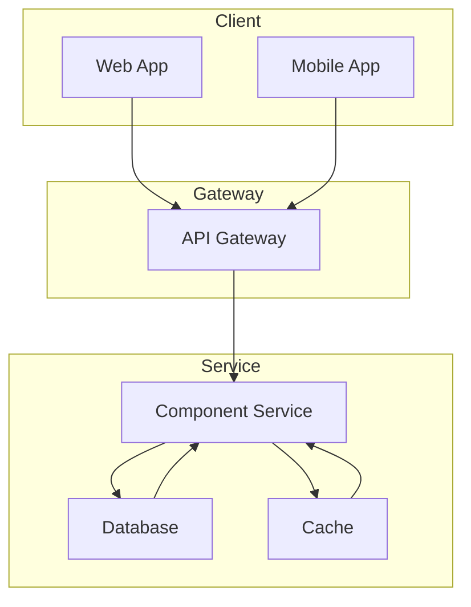

<!--
  WARNING: One-way sync only.
  Edits made directly in Confluence will be overwritten on the next push.
  Confluence is the read surface; the repo is the write surface.
-->

<!-- Space: YOUR_SPACE_KEY -->
<!-- Title: Architecture - Component Name -->
<!-- Parent: Architecture -->
<!-- Label: architecture -->
<!-- Label: component -->

# Architecture — Component Name

> Brief one-sentence description of this component or flow.

## Overview

What is this component? What does it do? Why does it exist?
Keep it short — 2-3 sentences maximum.

## Component Diagram



## Responsibilities

- **Responsibility 1**: Brief description
- **Responsibility 2**: Brief description

## Interfaces

### Inbound

| Endpoint | Method | Description |
|----------|--------|-------------|
| `/api/v1/resource` | GET | Retrieve resource |
| `/api/v1/resource` | POST | Create resource |

### Outbound

| Service | Protocol | Purpose |
|---------|----------|---------|
| Database | PostgreSQL | Persistent storage |
| Cache | Redis | Session caching |

## Resources

Place supporting diagrams in `resources/` subdirectory:

```
architecture/
└── resources/
    └── component-name/
        ├── deployment.mmd
        └── data-flow.mmd
```

## Related

- Related component: [Architecture - Related Component](./related-component.md)
- Related ADR: [ADR-XXXX](./adr/adr-XXXX.md)