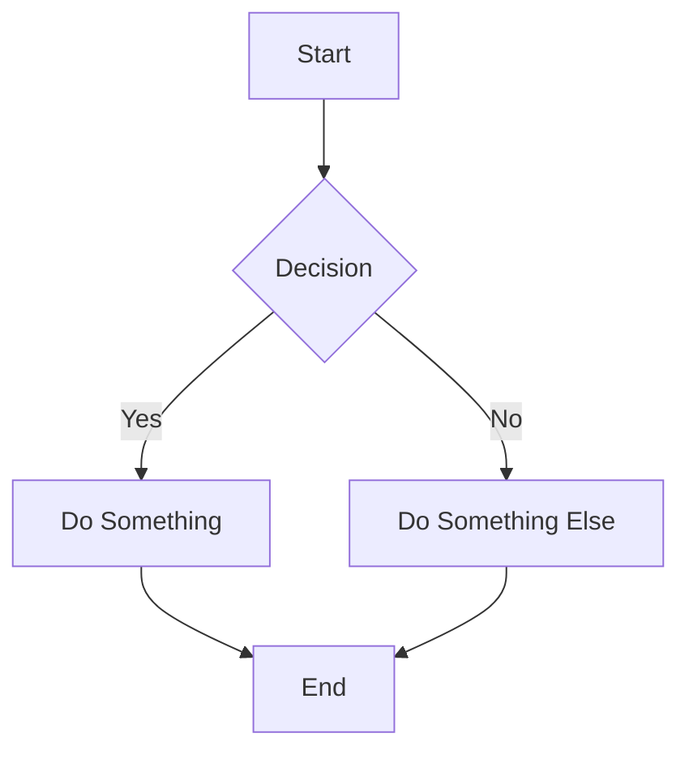

<!--
  WARNING: One-way sync only.
  Edits made directly in Confluence will be overwritten on the next push from the repo.
  Confluence is the read surface; the repo is the write surface.
-->

<!-- Space: YOUR_SPACE_KEY -->
<!-- Title: Your Page Title Here -->
<!-- Parent: Parent Page Name -->
<!-- Label: your-label -->
<!-- Label: another-label -->
<!-- Layout: article -->
<!-- Type: page -->

# Your Page Title Here

## Overview

Brief summary of what this document covers and why it matters.

## Details

Detailed content goes here. Use Confluence-flavored Markdown:

- **Bold** and *italic* text
- `inline code` and code blocks
- [links](https://example.com)
- Tables

| Column A | Column B |
|----------|----------|
| Value 1  | Value 2  |

## Diagrams

### Mermaid Example

### PlantUML Example

> **Note**: PlantUML is not auto-rendered by `mark`. Pre-render to PNG and use an image reference:
>
> 

## References

- [External Link](https://example.com)
- Related Confluence Page
- Related ADR