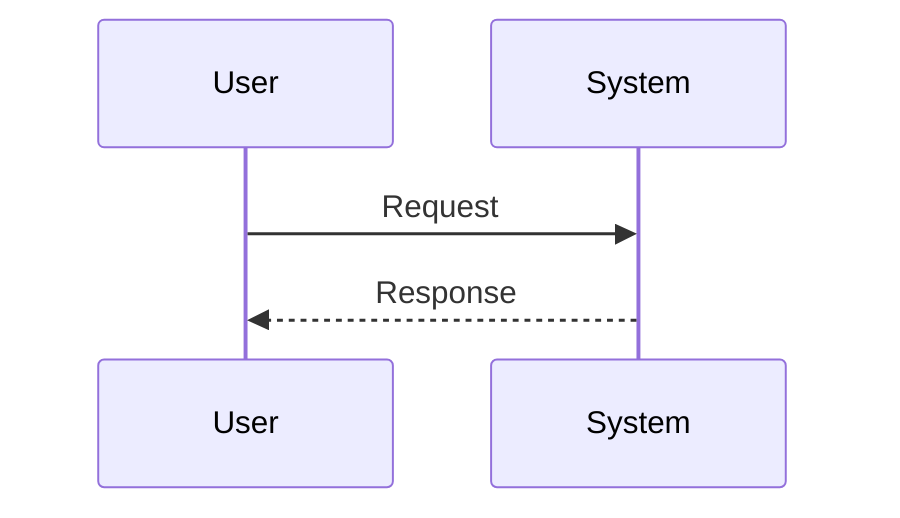

<!--
  WARNING: One-way sync only.
  Edits made directly in Confluence will be overwritten on the next push.
  Confluence is the read surface; the repo is the write surface.
-->

<!-- Space: YOUR_SPACE_KEY -->
<!-- Title: RFC NNNN - Your Proposal Title -->
<!-- Parent: Engineering Decisions -->
<!-- Label: rfc -->
<!-- Label: proposal -->

# RFC NNNN — Your Proposal Title

| | |
|---|---|
| **Status** | Draft |
| **Date** | YYYY-MM-DD |
| **Author** | Your Name |
| **Reviewers** | Reviewer 1, Reviewer 2 |

## Summary

One-paragraph summary of the proposal. What are we proposing and why does it matter?

## Motivation

Why are we doing this? What problem does it solve?
- Problem 1
- Problem 2

Describe the current state and why it is inadequate.

## Proposal

Detailed description of the proposed solution.
Explain how it works, what changes are required, and what the expected outcome is.

### Example Code or Configuration

```go
// Example code snippet
func main() {
    fmt.Println("Hello, World!")
}
```

### Diagram



## Alternatives Considered

| Alternative | Pros | Cons |
|-------------|------|------|
| Option A | ... | ... |
| Option B | ... | ... |

## Unresolved Questions

- Question 1 that needs discussion
- Question 2 to be decided before acceptance

## Risks

- Risk 1 and mitigation strategy
- Risk 2 and mitigation strategy

## Related

- [Link to related ADR or RFC](./adr-XXXX.md)
- External reference: [URL](https://example.com)